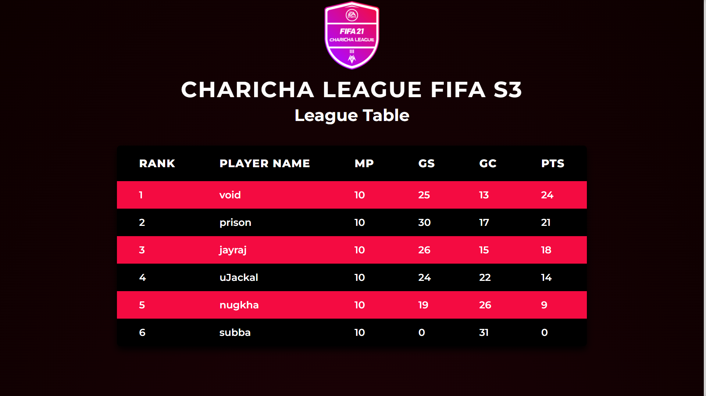

# Charicha FIFA League System
This is small test module for Charicha League System. We are focusing in Football League (FIFA) Management in this module. 

	

# Summary
This module helps a manager to add/register user for a tourney. 

## Features
* Automatically generates the fixtures and matches within the set time of the league.
* Calculates every users matches to fit the league. 
* Dynamically updates the league table according to matches results.

# Tech Stack
| Front-End           | Back-End         | Tools   |
|---------------------|------------------|---------|
| HTML                | NodeJS + Express | npm     |
| CSS                 |                  | Webpack |
| JavaScript          |                  | Emacs   |

## Two HTML Page
###  Client wala page,
- To View Current League Tables & Fixtures

### Manager wala Page,
- To View as well as Update the League Tables & Fixtures
- Also can create new League

